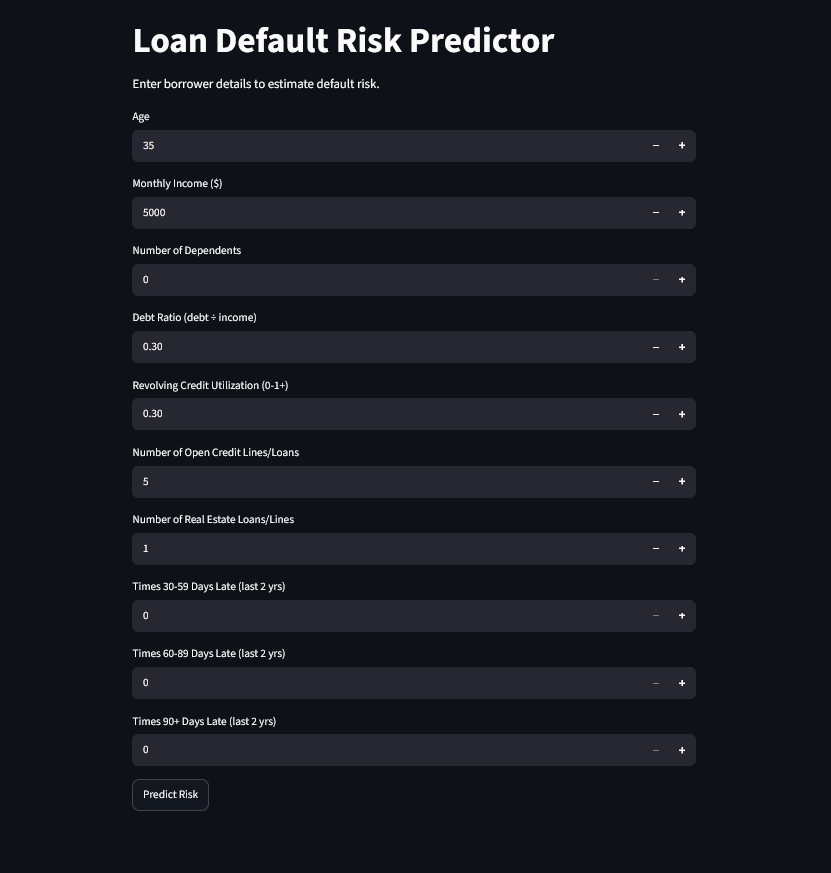
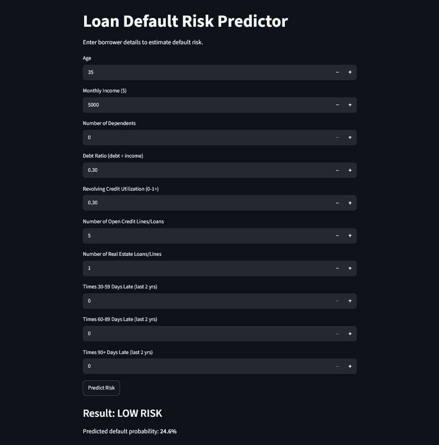

# Loan Default Risk Prediction

An end-to-end machine learning pipeline that predicts whether a borrower will default on a loan within 2 years, built to understand and demonstrate the full ML workflow — from raw, messy data to a deployed, interactive app.

**[Live demo instructions below](#running-the-app-locally)** · Built as a solo learning project by a Data Science undergraduate.

---

## Problem

Banks need to decide whether to approve a loan applicant, and getting it wrong is costly in both directions: approving a risky borrower can mean a defaulted loan (real financial loss), while rejecting a safe borrower means lost business. This project builds a model that estimates a borrower's probability of serious delinquency (90+ days late) within 2 years, using standard financial and credit-history features.

**Dataset:** [Give Me Some Credit](https://www.kaggle.com/datasets/brycecf/give-me-some-credit-dataset) (Kaggle) — 150,000 borrower records, 10 features, 1 target (`SeriousDlqin2yrs`).

---

## Key EDA Findings

- **Class imbalance:** 93.3% no-default vs 6.7% default — accuracy alone is a misleading metric here; the model needs to be evaluated on precision, recall, and ROC-AUC/PR-AUC instead.
- **Data quality issues found and fixed:**
  - Three late-payment columns contained placeholder error codes (96/98) disguised as real values — affected 269 rows (0.18%), removed.
  - `RevolvingUtilizationOfUnsecuredLines` and `DebtRatio` contained impossible values (max ratios in the tens of thousands). Investigated the root cause: **~93% of extreme `DebtRatio` rows overlapped with missing `MonthlyIncome`** — this was a pre-existing data artifact, not something fixable by imputing income after the fact. Fixed using IQR-based capping (not percentile-based — with 19% of rows affected, percentile capping still landed inside the contaminated range and had to be corrected).
  - 19.8% of rows had missing `MonthlyIncome`; imputed with the **training-set median only**, applied consistently to validation/test to avoid data leakage.
- **Confirmed real signal exists:** credit utilization differs sharply between defaulters (84% median) and non-defaulters (13% median); default rate drops monotonically with age, from 10.9% (under 30) to 3.1% (60+).

Full EDA notes with code: [`docs/eda_notes.md`](docs/eda_notes.md)

---

## Feature Engineering

| Feature              | Description                                                    | Impact                                                                                          |
| -------------------- | -------------------------------------------------------------- | ----------------------------------------------------------------------------------------------- |
| `TotalTimesLate`     | Sum of all three late-payment columns (30-59, 60-89, 90+ days) | **Strongest predictor overall** — defaulters average 7x more late instances than non-defaulters |
| `IncomePerDependent` | Monthly income ÷ (dependents + 1)                              | Modest signal (~18% gap between classes)                                                        |
| `AgeGroup`           | Binned age (`<30`, `30-45`, `45-60`, `60+`)                    | Confirms a clean, monotonic risk-by-age pattern; mainly useful for linear models                |

---

## Modeling

Three models were trained and compared on identical, leakage-free train/validation/test splits (70/15/15, stratified):

| Model                          | Precision | Recall    | ROC-AUC   | PR-AUC    |
| ------------------------------ | --------- | --------- | --------- | --------- |
| Logistic Regression (baseline) | 0.217     | 0.749     | 0.859     | —         |
| Random Forest                  | 0.228     | 0.751     | 0.865     | 0.382     |
| **Gradient Boosting (final)**  | 0.216     | **0.772** | **0.869** | **0.401** |

**Finding:** model complexity yielded consistent but diminishing returns — Gradient Boosting edges out simpler models, but not dramatically. Gradient Boosting was selected as the final model for its best recall and PR-AUC (the more informative metric on this imbalanced dataset).

**Classification threshold:** the default 0.5 cutoff was deliberately lowered to **0.4**, prioritizing recall (catching real defaulters) over precision, on the reasoning that a missed default typically costs a lender more than a wrongly-flagged safe borrower.

---

## Explainability (SHAP)

Feature importance was confirmed using **two independent methods** — Random Forest's impurity-based importance and permutation importance on the final Gradient Boosting model — both identifying `TotalTimesLate` and `RevolvingUtilizationOfUnsecuredLines` as the dominant predictors, well ahead of any other feature.

SHAP was also used to explain **individual predictions**, e.g.:

> A borrower with zero late payments and 40% credit utilization was scored as low-risk (25% default probability) — their clean payment history outweighed a moderately high credit usage.

This level of explainability is what would let a real lender justify an individual approval/rejection decision, not just report an aggregate accuracy number.

---

## Deployment

A Streamlit app (`app/app.py`) takes raw borrower inputs, replicates the training-time feature engineering live, and returns a risk classification with the predicted probability.

### Running the app locally

```bash
git clone https://github.com/SadeeshaJayawardhana/loan-default-risk-prediction.git
cd loan-default-risk-prediction
python -m venv venv
source venv/Scripts/activate    # Windows Git Bash; use venv/bin/activate on Mac/Linux
pip install -r requirements.txt
python -m streamlit run app/app.py
```




---

## Project Structure

```
loan-default-risk-prediction/
├── data/
│   ├── raw/              # cs-training.csv (not committed — see Kaggle link above)
│   └── processed/        # cleaned + feature-engineered data (regenerated by notebooks)
├── notebooks/
│   ├── 01_eda_and_preprocessing.ipynb
│   ├── 03_feature_engineering.ipynb
│   ├── 04_model_training.ipynb
│   └── 05_shap_explainability.ipynb
├── models/                # saved model + scaler (not committed, regenerated by notebook 04)
├── app/
│   └── app.py             # Streamlit deployment app
├── docs/
│   └── eda_notes.md
├── results.txt             # model comparison metrics
├── requirements.txt
└── README.md
```

---

## Tech Stack

Python · pandas · scikit-learn · SHAP · imbalanced-learn · Streamlit · matplotlib/seaborn

## Possible Future Improvements

- Hyperparameter tuning (grid/random search) on the Gradient Boosting model
- Try XGBoost/LightGBM directly for comparison
- Add model monitoring / retraining pipeline
- Expand the app with a batch-prediction (CSV upload) mode
